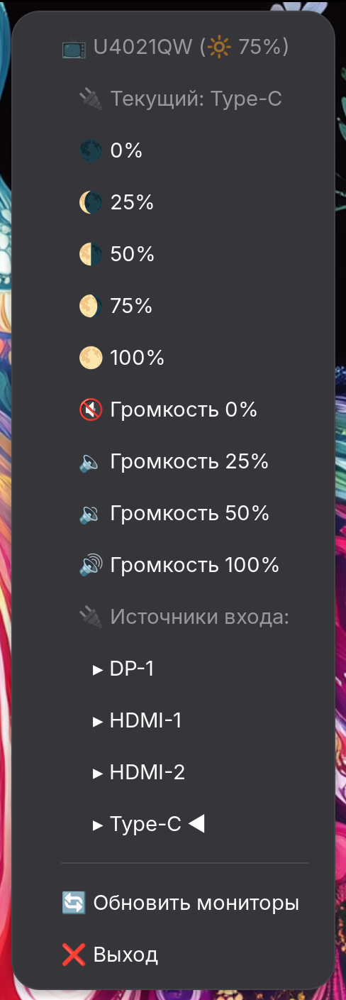

<table>
<tr>
<td width="60%">

# Monitor Control 🖥️

Приложение для управления внешними мониторами через системный трей с поддержкой плавной анимации и автоматического обновления.

## Основные функции:
- 🔆 Управление яркостью с плавной анимацией
- 🔊 Контроль громкости встроенных динамиков  
- 🔌 Переключение источников входа
- 📺 Поддержка множественных мониторов
- 🎨 Современный интерфейс в системном трее

## ✨ Возможности

- 🔆 **Управление яркостью** с плавной анимацией (0-100%)
- 🔊 **Управление громкостью** встроенных динамиков монитора
- 🔌 **Переключение источников входа** (HDMI, DisplayPort, USB-C)
- 🎬 **Плавная анимация** изменения яркости
- 🔄 **Автоматическое обновление** информации о мониторах
- 📺 **Поддержка множественных мониторов**
- 🎨 **Современный интерфейс** в системном трее
- 🚀 **Быстрые кнопки** для часто используемых настроек

</td>
<td width="40%">



</td>
</tr>
</table>

## 📋 Требования

- **Операционная система**: Linux с поддержкой X11/Wayland
- **Python**: 3.7+
- **Монитор**: Поддержка DDC/CI протокола
- **Системный трей**: GNOME, KDE, или другая DE с поддержкой system tray

## Быстрый старт на Alt Linux 

```
git clone https://github.com/toxblh/Monic.git
cd Monic
./install.sh

# Ставим pip
sudo apt-get install pip

# И выдаём доступ на усправление шиной i2c
sudo mkdir -p /etc/modules-load.d; echo i2c-dev | sudo tee /etc/modules-load.d/i2c-dev.conf
sudo groupadd i2c
sudo chown :i2c /dev/i2c-*
sudo usermod -aG i2c $USER
echo 'KERNEL=="i2c-[0-9]*", GROUP="i2c"' | sudo tee -a /etc/udev/rules.d/10-i2c.rules
sudo udevadm control --reload-rules
sudo udevadm trigger

# Первый запуск с консоли (долгий), далее можно из меню приложений
~/.local/share/monitor-control/run_monitor_control.sh
```

## 🛠️ Установка

### 1. Клонирование репозитория
```bash
git clone https://github.com/toxblh/Monic.git
cd Monic
```

### 2. Установка зависимостей
```bash
pip install -r requirements.txt
```

### 3. Настройка монитора
Убедитесь, что DDC/CI включен в настройках вашего монитора:
- Зайдите в меню монитора
- Найдите раздел "Дополнительно" или "Advanced"
- Включите "DDC/CI" или "DDC Command Interface"

## 🚀 Запуск

### Способ 1: Установка как системное приложение (рекомендуется)

```bash
# Установка в систему
./install.sh

# После установки приложение будет доступно в меню приложений
# Поиск: "Monitor Control"
```

### Способ 2: Запуск из директории

```bash
# Прямой запуск
python3 monitor_control.py

# Или через скрипт запуска
./run_monitor_control.sh
```

После запуска приложение появится в системном трее. Щелкните правой кнопкой мыши по иконке для доступа к меню управления.

## 🗑️ Удаление

Если приложение было установлено через `install.sh`:

```bash
./uninstall.sh
```

## 📖 Использование

### Управление яркостью
- 🌑 **0%** - Минимальная яркость
- 🌘 **25%** - Низкая яркость  
- 🌗 **50%** - Средняя яркость
- 🌖 **75%** - Высокая яркость
- 🌕 **100%** - Максимальная яркость

### Управление громкостью
- 🔇 **0%** - Беззвучный режим
- 🔈 **25%** - Тихо
- 🔉 **50%** - Средняя громкость
- 🔊 **100%** - Максимальная громкость

### Переключение источников
- **DP-1** - DisplayPort 1
- **HDMI-1** - HDMI порт 1
- **HDMI-2** - HDMI порт 2
- **Type-C** - USB-C (если поддерживается)

## ⚙️ Конфигурация

Основные параметры можно настроить в файле `monitor_control.py`:

```python
# Настройки анимации
ANIMATION_DURATION_MS = 400    # Длительность анимации (мс)
ANIMATION_STEPS = 40           # Количество шагов анимации

# Автообновление
UPDATE_INTERVAL_MS = 10000     # Интервал обновления (10 сек)
```

## 🔧 Архитектура

### Основные компоненты

- **`main()`** - Точка входа и инициализация приложения
- **`BrightnessAnimator`** - Класс для плавной анимации яркости
- **`scan_monitors()`** - Сканирование и обнаружение мониторов
- **`create_monitor_menus()`** - Создание меню для управления
- **`update_brightness_display()`** - Автоматическое обновление UI

### Поддерживаемые протоколы

- **DDC/CI** (Display Data Channel Command Interface)
- **VCP** (Virtual Control Panel) коды для управления параметрами

## 📁 Структура файлов

```
Monic/
├── monitor_control.py          # Основное приложение
├── requirements.txt            # Python зависимости
├── README.md                  # Документация
├── icon.png                   # Иконка приложения
├── monitor-control.desktop    # Desktop файл (для разработки)
├── run_monitor_control.sh     # Скрипт запуска
├── install.sh                 # Скрипт установки в систему
└── uninstall.sh              # Скрипт удаления
```

## 🔧 Технические детали

### Desktop Integration
- Приложение может быть установлено как системное приложение
- Автоматическое создание виртуального окружения
- Интеграция с меню приложений рабочего стола
- Поддержка современных desktop-файлов

### Анимация
- Плавная анимация изменения яркости за 400ms
- 40 шагов анимации для гладкого перехода
- Обновление иконки в трее в реальном времени

### Автообновление
- Обновление информации каждые 10 секунд
- Дебаунсинг для предотвращения частых обновлений
- Безопасные межпоточные обновления UI

## 🐛 Устранение неполадок

### Мониторы не обнаружены
1. Проверьте, что DDC/CI включен в настройках монитора
2. Убедитесь, что кабель поддерживает передачу данных (не только видео)
3. Попробуйте другой порт (DisplayPort обычно работает лучше HDMI)

### Ошибки разрешений
```bash
# Добавьте пользователя в группу i2c
sudo usermod -a -G i2c $USER
# Перелогиньтесь после выполнения команды
```

### Системный трей не отображается
- Убедитесь, что ваша DE поддерживает system tray
- Для GNOME установите расширение "AppIndicator Support"

## 📝 Логирование

Приложение выводит подробную информацию в консоль:
- ✅ Успешные операции
- ❌ Ошибки и проблемы  
- 🔄 Статус обновлений
- 🎬 Информация об анимации

## 🤝 Вклад в проект

1. Сделайте Fork репозитория
2. Создайте ветку для новой функции (`git checkout -b feature/amazing-feature`)
3. Сделайте коммит изменений (`git commit -m 'Add amazing feature'`)
4. Отправьте в ветку (`git push origin feature/amazing-feature`)
5. Откройте Pull Request

## 📜 Лицензия

Этот проект распространяется под лицензией MIT. См. файл `LICENSE` для подробностей.

## 🙏 Благодарности

- [monitorcontrol](https://github.com/newAM/monitorcontrol) - Библиотека для управления мониторами
- [PyQt6](https://www.riverbankcomputing.com/software/pyqt/) - GUI фреймворк
- [DDC/CI стандарт](https://en.wikipedia.org/wiki/Display_Data_Channel) - Протокол управления мониторами

## 📞 Поддержка

При возникновении проблем:
1. Проверьте раздел "Устранение неполадок"
2. Создайте Issue с подробным описанием проблемы
3. Приложите логи из консоли

---

**Версия**: 1.0.0  
**Автор**: toxblh
